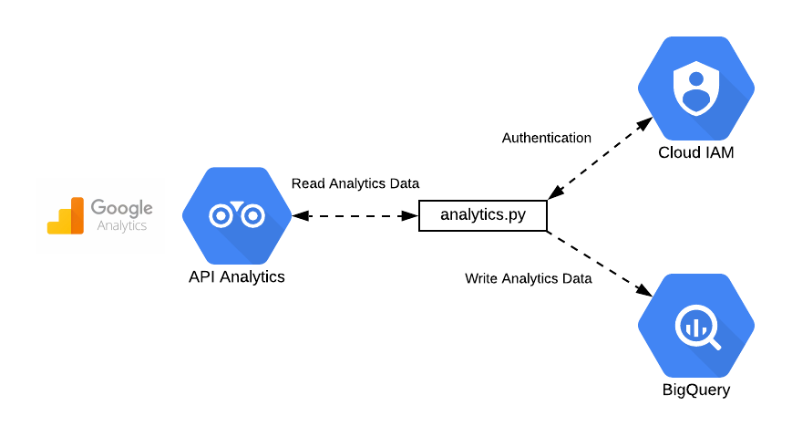

# google-analytics-big-query-importer

## Overview

A Python script that extracts data from [Google Analytics](https://analytics.google.com/analytics/web/provision/?authuser=0#/provision) (GA) and imports it into a Google [Big Query](https://cloud.google.com/bigquery/) (BQ) table.

Google offer a [native method](https://support.google.com/analytics/answer/3416092) of exporting your GA data into BQ, however it is only available in the GA 360 product which costs $$$$.

For those that don't use GA 360 we have created a Python script that calls the GA API, extracts the user activity data and writes it into a specified BQ table.

## Why?

Having your GA data loaded into BQ gives you various options to do interesting things with your data such as:

* Recommendations: By [grouping together](https://cloud.google.com/bigquery-ml/docs/kmeans-tutorial) users with similar browsing habits, you could recommend other areas of your website that a user might be interested in.
* Custom Dashboards: Using Google [Data Studio](https://datastudio.google.com) to create dashboards that combine other data sources in order to enrich your GA data.

## How?



### Pre-requisites

1. [Create a Google Cloud Project](https://cloud.google.com/resource-manager/docs/creating-managing-projects).
2. Within this Project [create a Service Account](https://cloud.google.com/iam/docs/creating-managing-service-accounts).
3. For that Service Account [create a JSON service account key](https://cloud.google.com/iam/docs/creating-managing-service-account-keys#creating_service_account_keys).
4. [Enable the Google Analytics API](https://developers.google.com/analytics/devguides/config/mgmt/v3/authorization).

Note: Google have created a [Setup Tool](https://console.developers.google.com/start/api?id=analyticsreporting.googleapis.com&credential=client_key) that will guide you through steps 1-4.

5. [Add the Service Account](https://support.google.com/analytics/answer/1009702) to the Google Analytics Account with 'Read & Analyze' permissions.
6. Use the Google Analytics [Account Explorer](https://ga-dev-tools.appspot.com/account-explorer/) to obtain the View ID that you want to extract data from.
7. [Grant Roles to the Service Account](https://cloud.google.com/iam/docs/granting-roles-to-service-accounts) - 'BigQuery Data Editor', 'BigQuery Job User'
8. [Create a BigQuery DataSet](https://cloud.google.com/bigquery/docs/datasets).

### Authentication

TODO - describe how we use Google IAM to auth with Analytics and BQ

### Usage

When running for the first time, it's necessary to set up the Python virtualenv and install dependencies:

```
virtualenv env
source env/bin/activate
pip install -r requirements.txt
```

You'll also need to set the `GOOGLE_APPLICATION_CREDENTIALS` environment variable to the location of the key JSON corresponding to the service account which you set up in `Authentication`. For example:

```
export set GOOGLE_APPLICATION_CREDENTIALS=/home/<you>/.keys/ga-service-account.json
```

To run the script:

```
python analytics.py -v <your view ID> -t <destination big query table>
```

The destination BigQuery table will be created, and it should not already exist. It should be a fully-qualified path of the form `<project id>.<dataset id>.<table id>`; for example `fuzzylabs.analytics.test`.

A Dockerfile is also provided if you would prefer to run this in a container:

```
docker build -t ga_bq_importer .
docker run \
         -e GOOGLE_APPLICATION_CREDENTIALS=/tmp/keys/gcloud_creds.json \
         -v $GOOGLE_APPLICATION_CREDENTIALS:/tmp/keys/gcloud_creds.json:ro \
         ga_bq_importer -v <your view ID> -t <destination big query table>
```
